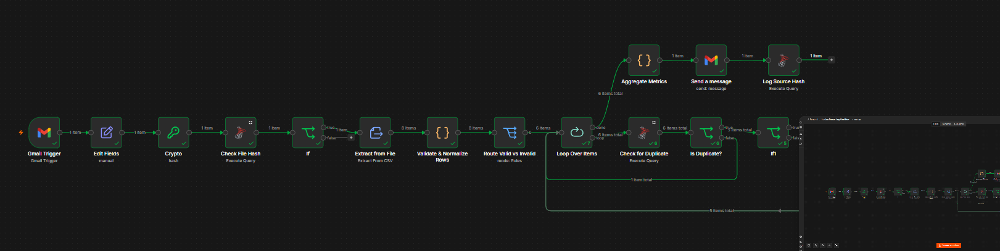
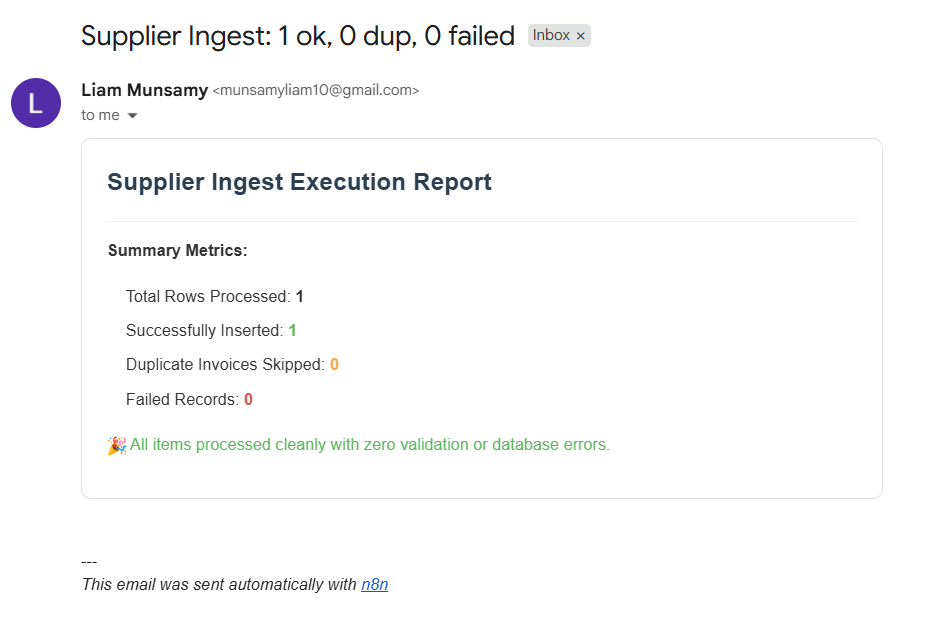
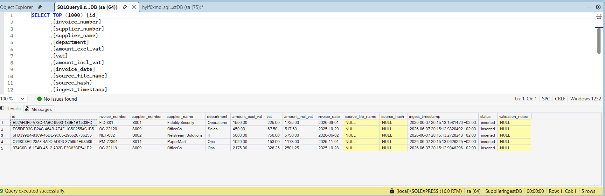
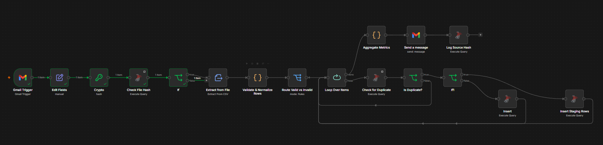

# Supplier Invoice Ingestion Pipeline

An automated backend data pipeline built in n8n that monitors an inbox for supplier invoice batches via CSV, performs robust validation checks, prevents duplicate data insertion, logs records directly to a Microsoft SQL Server database, and dispatches a metrics digest email.

---

## 1. How the Workflow Runs (Triggers & Infrastructure)

This system is built to operate completely unattended in **Production Mode**. It relies on an automated event trigger to wake up, execute its logic, and go back to sleep.

### The Trigger Mechanism:
* **Node Used:** `Gmail Trigger`
* **How it works:** The workflow connects to a dedicated inbox. It is configured to monitor incoming emails continuously. 
* **Filters applied:** It ignores regular emails and only activates if an incoming message contains a file attachment ending with the `.csv` extension. 
* **Execution:** When the workflow toggle switch in n8n is flipped to **Active**, this trigger runs entirely in the background. You do not need to click "Execute Workflow" manually; the pipeline fires automatically the moment a supplier sends an email.

---

## 2. Input File Format & Key Mappings

The pipeline expects a flat batch file containing invoice rows (for example, named `supplier_batch.csv`). 

### Expected CSV Layout:
The file must contain a header row defining the columns exactly like this:
```csv
supplier_number,supplier_name,invoice_number,department,invoice_date,amount_excl,vat_rate

```

### Data Normalization & Mapping:

Inside the workflow, the JavaScript node dynamically extracts these incoming text values and maps them directly into structured variables for database insertion. This ensures names match your SQL tables exactly, even if formatting varies:

| Source CSV Column | Description / Mapping Logic | Target Database Column |
| --- | --- | --- |
| `supplier_number` | Unique alphanumeric supplier code (e.g., `S009`) | `supplier_number` |
| `supplier_name` | Trading name of the supplier company | `supplier_name` |
| `invoice_number` | Document reference identification code | `invoice_number` |
| `department` | Target internal business unit (e.g., `Ops`, `Sales`) | `department` |
| `invoice_date` | Date string normalized uniformly into an ISO Date format | `invoice_date` |
| `amount_excl` | Base transaction value parsed as a decimal number | `amount_excl_vat` |
| `vat_rate` | Read from file. If blank, automatically defaults to `15` | `vat_rate_applied` |
| *Calculated Value* | Automatically calculated: `amount_excl * (vat_rate / 100)` | `vat` |
| *Calculated Value* | Automatically calculated: `amount_excl + calculated_vat` | `amount_incl_vat` |

---

## 3. Database Schema Creation (SQL Scripts)

Before connecting n8n to your Microsoft SQL Server instance via **SQL Server Management Studio (SSMS)**, you must create the storage tables. Open SSMS, connect to your server, and execute these Data Definition Language (DDL) scripts to create your tables:

```sql
-- Switch to your target database instance
USE SupplierIngestDB;
GO

-- 1. FILE HASH LOG TABLE
-- This table records a unique fingerprint (hash) of every file processed.
-- If someone sends the same file twice, the system catches it here and stops.
CREATE TABLE dbo.processed_files_log (
    id INT IDENTITY(1,1) PRIMARY KEY,
    file_hash VARCHAR(64) NOT NULL UNIQUE,
    file_name VARCHAR(255) NULL,
    extracted_at DATETIME DEFAULT GETDATE()
);

-- 2. LIVE PRODUCTION INVOICES TABLE
-- This is the final target database where all successfully validated rows are kept permanently.
CREATE TABLE dbo.supplier_invoices (
    id UNIQUEIDENTIFIER DEFAULT NEWID() PRIMARY KEY,
    invoice_number VARCHAR(100) NOT NULL,
    supplier_number VARCHAR(50) NOT NULL,
    supplier_name VARCHAR(100) NOT NULL,
    department VARCHAR(50) NOT NULL,
    amount_excl_vat DECIMAL(18,2) NOT NULL,
    vat DECIMAL(18,2) NOT NULL,
    amount_incl_vat DECIMAL(18,2) NOT NULL,
    invoice_date DATE NOT NULL,
    source_file_name VARCHAR(255) NULL,
    source_hash VARCHAR(64) NULL,
    ingest_timestamp DATETIMEOFFSET DEFAULT SYSDATETIMEOFFSET(),
    status VARCHAR(50) DEFAULT 'inserted',
    validation_notes VARCHAR(MAX) NULL
);

-- 3. INVOICES STAGING & FAILURES LANDING ZONE
-- Used during dry runs or for keeping a local log of temporary processing batches.
CREATE TABLE dbo.supplier_invoices_staging (
    id INT IDENTITY(1,1) PRIMARY KEY,
    supplier_number VARCHAR(50),
    supplier_name VARCHAR(100),
    invoice_number VARCHAR(100),
    department VARCHAR(50),
    invoice_date DATE,
    amount_excl_vat DECIMAL(18,2),
    vat DECIMAL(18,2),
    amount_incl_vat DECIMAL(18,2),
    vat_rate_applied INT,
    valid BIT,
    validation_notes VARCHAR(MAX)
);

```

---

## 4. n8n Database Connection Setup

To securely link n8n to your database, you use n8n's **Credentials Manager**. This keeps your database password encrypted and hidden from the workflow canvas.

### Configuration Parameters:

When setting up or updating the connection parameters inside your SQL Server nodes, use these explicit environments settings:

* **Credential Type:** `Microsoft SQL Server Credentials`
* **Host / Server IP:** `127.0.0.1` (or your direct database instance location)
* **Port:** `1433` (The default communication port for SQL Server engines)
* **Database Name:** `SupplierIngestDB`
* **Authentication Method:** `SQL Server Authentication`
* **User (User ID):** `sa` (System Administrator Account)
* **Password:** *(Your encrypted system password entered during server deployment)*

*Tip for Local Testing:* If you are executing n8n locally alongside an instance of **SQL Server Express (`.\SQLEXPRESS`)**, ensure TCP/IP connections are enabled in your *SQL Server Configuration Manager* so that port `1433` accepts traffic.

---

## 5. Row-Wise Validation Logic & Code Rules

Every single row within an extracted CSV batch is checked individually against strict business logic inside the custom JavaScript node. A row is flagged as **Invalid** if it fails any of these criteria:

1. **Required Fields Check:** All key data points (`supplier_number`, `supplier_name`, `invoice_number`, `department`, `invoice_date`, and `amount_excl`) must exist. If any are blank, the row is rejected immediately.
2. **South African VAT Math Fallback:** The engine searches for a provided `vat_rate`. If the supplier omitted the rate column or left it blank, the code automatically inherits the South African standard **15%** default value.
3. **Future Date Prevention (Timezone Guard):** To stop forward-dated invoices from breaking accounting ledgers, row dates are evaluated directly against the host machine's system clock. The validation runtime is explicitly locked into the **`Africa/Johannesburg`** timezone to ensure exact local compliance.

### Expected Input vs. Code Output Examples:

* **Clean Row Example:** * *Input:* `S009,OfficeCo,OC-22119,Ops,2025-10-28,2175.00,15`
* *Output Status:* `valid: true`, `validation_notes: "Clear"`


* **Missing Field Example:** * *Input:* `S999,BrokenDataCo,,Ops,2026-01-01,300.00,15` *(Missing Invoice Number)*
* *Output Status:* `valid: false`, `validation_notes: "Missing one or more required fields."`


* **Future Date Example:** * *Input:* `S004,FutureCorp,FUT-884,Sales,2027-12-25,850.00,15` *(Post-dated to 2027)*
* *Output Status:* `valid: false`, `validation_notes: "Invoice date 2027-12-25 cannot be in the future."`


---

## 6. Email Node Configuration

Once the processing loop completes its run, the workflow passes through an **Aggregate Metrics** node which calculates the processing counts. This aggregates into a single event that triggers the email alert node.

* **Node Class Type:** `Gmail / Send a message`
* **Trigger Placement:** Placed immediately at the end of the data pipeline following the loop's **`done`** execution path.
* **Email Scope:** It sends a clean, HTML-formatted summary digest directly to target stakeholders.
* **Dynamic Fields Used:** It uses expression tokens to dynamically embed the final counts inside the message body (e.g., `{{ $json.total_rows }}`, `{{ $json.inserted }}`). This ensures your operational teams receive an exact status report of how many rows succeeded, dropped into staging, or were skipped as duplicates without having to open the database.

---

## 7. Execution Results (Row Status Audit Log)

This table shows exactly how the batch rows from your expanded testing data file are classified, validated, and logged to the SQL Server database layout after processing:

| supplier_number | invoice_number | valid | validation_notes / Status | Target Destination |
| --- | --- | --- | --- | --- |
| `S001` | `FID-881` | `1` (True) | Clear / `inserted` | `dbo.supplier_invoices` |
| `S009` | `OC-22120` | `1` (True) | Clear / `inserted` | `dbo.supplier_invoices` |
| `S002` | `NET-882` | `1` (True) | Clear *(Inherited 15% VAT Fallback)* | `dbo.supplier_invoices` |
| `S011` | `PM-77891` | `1` (True) | Clear / `inserted` | `dbo.supplier_invoices` |
| `S009` | `OC-22119` | `1` (True) | Clear / `inserted` | `dbo.supplier_invoices` |
| `S999` | *(Blank)* | `0` (False) | Missing one or more required fields. | Filtered / Logged to failures |
| `S004` | `FUT-884` | `0` (False) | Invoice date cannot be in the future. | Filtered / Logged to failures |

---
## 8. Pipeline Execution Verification & Screenshots

Below are the actual pipeline testing screenshots showing how the system reacts in real time to processing requests, duplicates, and communication handling.

### Screenshot 1: Successful Batch Insert
*Captured when a brand new, unique file is sent. The workflow passes the hash gate, loops through all valid line items, and writes them straight to your database.*


### Screenshot 2: Duplicate File Skip (Early Exit)
*Captured when the exact same file batch is resent. The workflow calculates the matching file hash, evaluates to `false` at the early check gate, and instantly terminates processing to protect database integrity.*


### Screenshot 3: Automated Execution Email Summary Report
*The clean HTML notification report received inside the mailbox showing aggregate metrics and runtime execution summaries after a processing pass completes.*


### Database Verification: Target SQL Server Results Grid
*Direct data verification grid pulled straight from SQL Server Management Studio (SSMS) confirming data landing states.*



```

```
